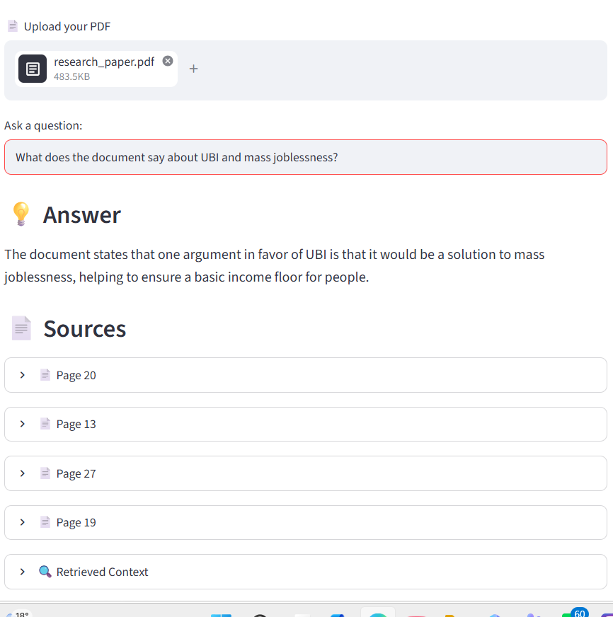
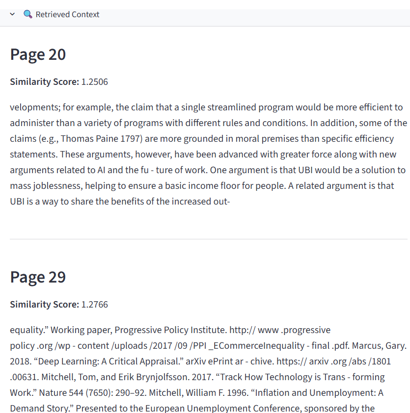

# 📚 PDF RAG Assistant

A conversational Retrieval-Augmented Generation (RAG) application that allows users to upload one or more PDF documents and ask questions about their content.

The application retrieves relevant information from the uploaded documents using vector similarity search and generates grounded answers using a locally running LLM.

---

## 🖥️ Application Preview

### PDF Upload and Chat


### RAG Answer



### Source References



## 🚀 Features

- 📄 Upload one or multiple PDF documents
- 🔎 Semantic search over document content
- 🧩 Automatic document chunking
- 🧠 Local Hugging Face embeddings
- 🗃️ FAISS vector database for similarity search
- 🔄 MMR-based document retrieval
- 🤖 Local LLM using Ollama
- 💬 Conversational chat history
- 📑 Source tracking with PDF name and page number
- 🗑️ Clear chat functionality
- 🔒 No external LLM API key required

---

## 🧠 What is RAG?

Retrieval-Augmented Generation (RAG) combines information retrieval with a Large Language Model.

Instead of asking the LLM to answer a question entirely from its pretrained knowledge, the application first searches the uploaded documents for relevant information and then provides that information to the LLM as context.

### RAG workflow

```text
PDF Documents
      ↓
PDF Text Extraction
      ↓
Text Chunking
      ↓
Hugging Face Embeddings
      ↓
FAISS Vector Database
      ↓
Similarity / MMR Retrieval
      ↓
Relevant Document Chunks
      ↓
Prompt + Retrieved Context
      ↓
Ollama LLM
      ↓
Grounded Answer + Sources


Architecture

                    ┌──────────────────┐
                    │   PDF Documents  │
                    └────────┬─────────┘
                             │
                             ▼
                    ┌──────────────────┐
                    │  PyPDFLoader     │
                    │  Text Extraction │
                    └────────┬─────────┘
                             │
                             ▼
                    ┌──────────────────┐
                    │ Text Splitter    │
                    │ 700 / 100 chunks │
                    └────────┬─────────┘
                             │
                             ▼
                    ┌──────────────────┐
                    │ Hugging Face     │
                    │ Embeddings       │
                    └────────┬─────────┘
                             │
                             ▼
                    ┌──────────────────┐
                    │ FAISS Vector DB  │
                    └────────┬─────────┘
                             │
                    User Question
                             │
                             ▼
                    ┌──────────────────┐
                    │ MMR Retriever    │
                    └────────┬─────────┘
                             │
                             ▼
                    ┌──────────────────┐
                    │ Relevant Context │
                    └────────┬─────────┘
                             │
                             ▼
                    ┌──────────────────┐
                    │ Ollama / Llama   │
                    │ 3.2 3B           │
                    └────────┬─────────┘
                             │
                             ▼
                    ┌──────────────────┐
                    │ Answer + Sources │
                    └──────────────────┘